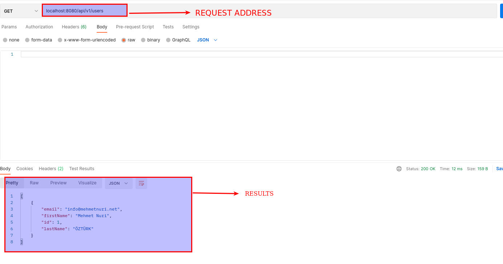

# Simple Quarkus Crud Rest API

This is a simple CRUD Rest API using Quarkus and Hibernate ORM.

# Routes

Address: localhost:8080
- GET /api/v1/users 
- GET /api/v1/users/{id}
- GET /api/v1/users/email/{email_address}
- POST /api/v1/users
- PUT /api/v1/users/{id}
- DELETE /api/v1/users/{id}

# How to run

```bash
./mvnw compile quarkus:dev
```


